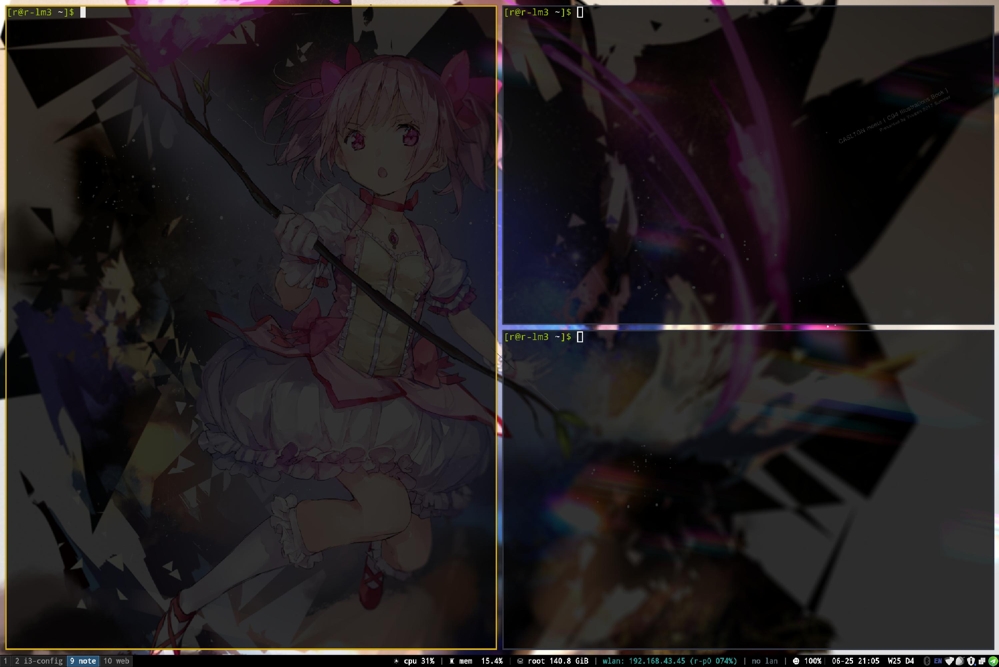
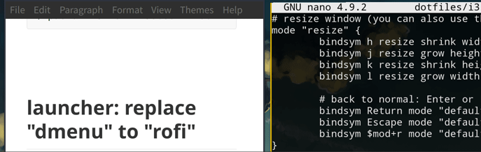
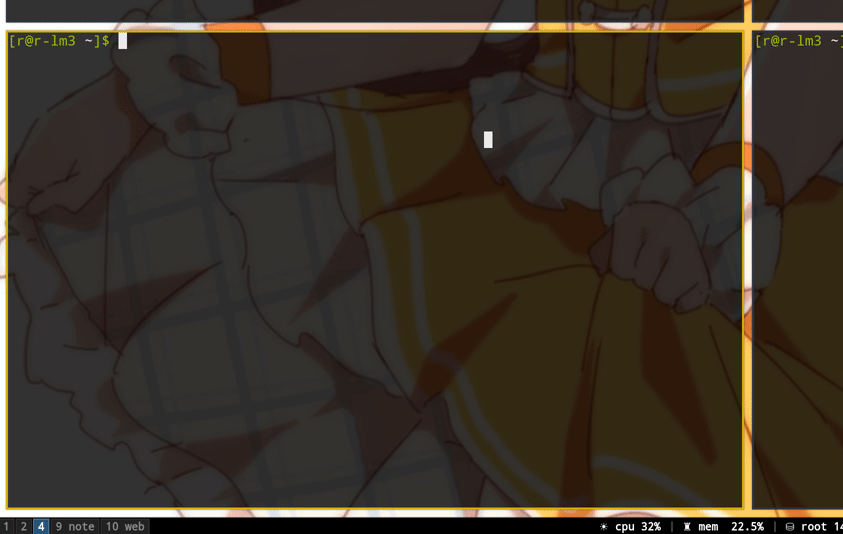
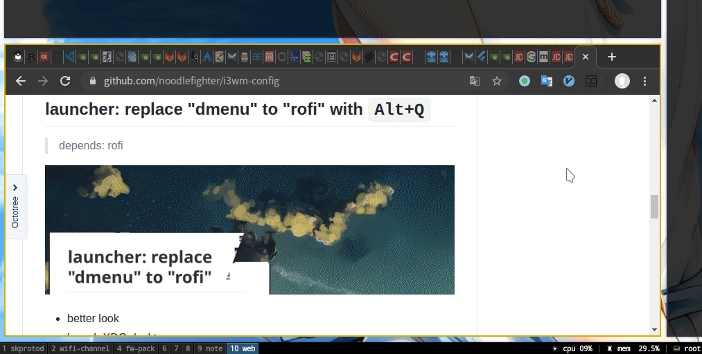
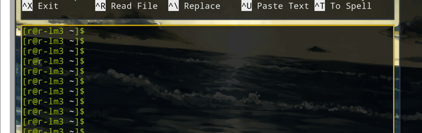

# i3wm-config





Usage:

1. install requirements programs

```
$ sudo pacman -S i3-gaps i3status picom rofi xdotool wmctrl feh
$ sudo pip install i3-py
```

2. copy `.config ` folder to `$HOME/.config`(remember to backup)


Tips:

* recommend terminal program is **alacritty**
* run i3wm in other general desktop environment could make things easier (e.g. i3-cinnamon)


## launcher: replace "dmenu" to "rofi" with `Alt+Q` 

> depends: rofi



* better look
* launch XDG desktop program


## exit menu with `Supper+X`

> i3exit script picked up from i3-manjaro


## rename workspace name with `Supper+N`

> depends: rofi




## quick switch windows with `Supper+M`

> quickswitch script from: https://github.com/proxypoke/quickswitch-for-i3
>
> depends: python3 i3-py




## rename a windows and show titlebar `Supper+T` 

> depends: rofi,xdotool,wmctrl



* for adding tip for some windows looks the same
* for quick switching windows by `Supper+M`


## random desktop backgrounds

>  depends: feh

change the backgound regularly, edit config in `.config/i3/random-bg-picture.sh`

